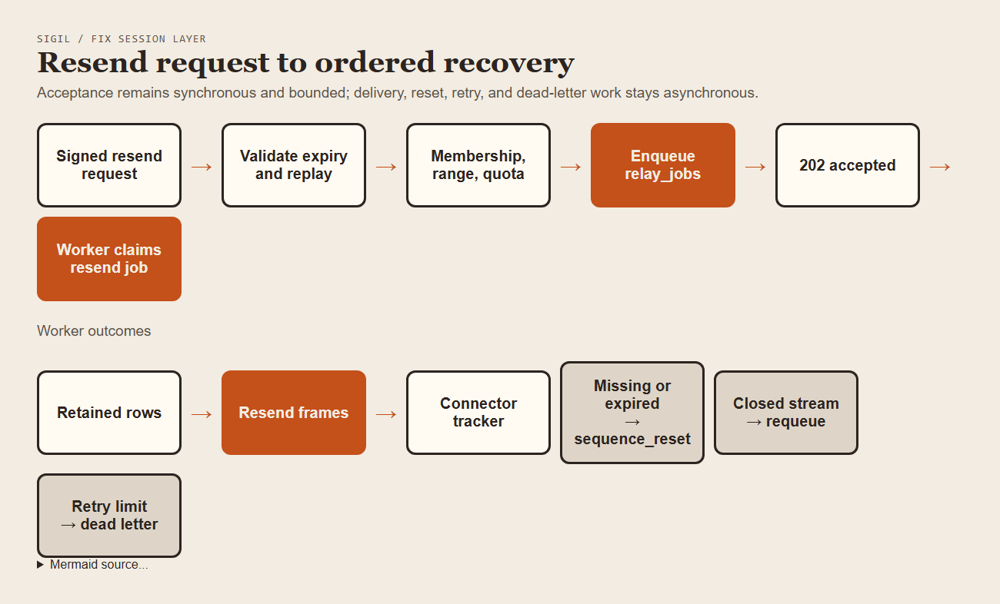
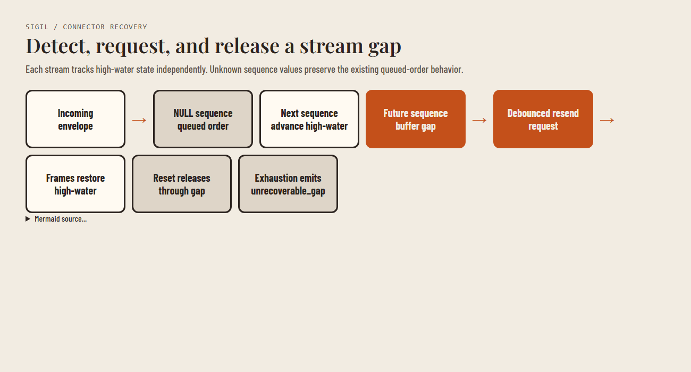

# Session layer rollout handoff

## Order

1. Apply migrations 020–023 to each relay database in order. Confirm the
   migration ledger before starting the relay.
2. Deploy code that understands both NULL and populated `stream_seq` values.
3. Keep `stream_seq.enabled` false until all relay and connector versions are
   deployed and monitored.
4. Enable sequencing per relay, then watch resend requests, queue age, resets,
   and dead letters.

## Mixed fleet and rollback

- Older relays continue accepting envelopes with NULL `stream_seq`.
- New connectors fall back to queued order for NULL-sequence envelopes.
- Disable `stream_seq.enabled` to stop assigning new sequences; existing
  sequence values remain readable.
- `relay_jobs` is a one-way schema transition. Drain or manually review typed
  jobs before a code rollback; do not rename the table back.

## Recovery operations

- Resend ranges are capped at 500 messages, and `end_seq: 0` resolves to the
  sender stream high-water mark.
- Resend work stays asynchronous and never creates a delivery for the request.
- Closed requester streams requeue with bounded backoff; dead-letter occurs
  only after the configured retry maximum.
- Expired or missing ranges emit `sequence_reset`; connectors eventually emit
  `unrecoverable_gap` after recovery retries or buffer exhaustion.

## Validation status

The executable vertical slice passed 4/4 tests. The directory-trust case and
live PostgreSQL gate require `SIGIL_TEST_DATABASE_URL`; the current environment
does not provide it. Production rollout still requires Tier 1,
privacy/compliance-owner, and counsel approval.
